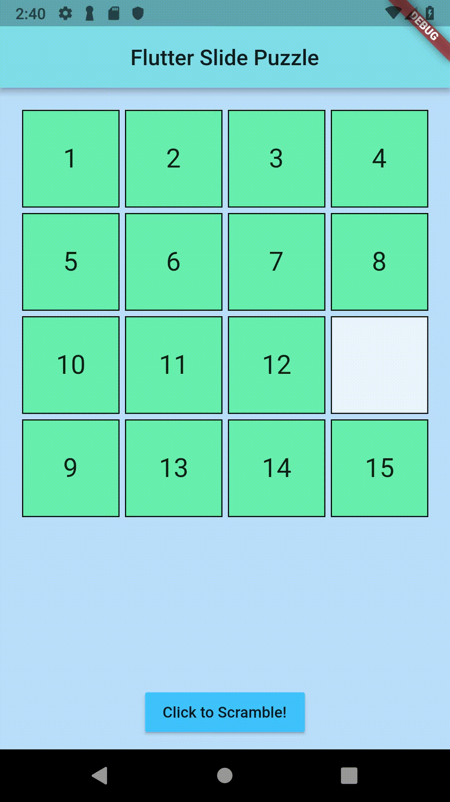

# Flutter Slide Puzzle

## Getting Started

Clone this repo

`$ cd Flutter-Slide-Puzzle-Hummingbird`

`$ flutter packages get`

`$ pub get`

`$ webdev serve`

if webdev doesn't work:

`$ pub run build_runner serve`

## About

A simple slide puzzle game.

Slide the tiles to arrange the numbers into proper order.

## Build your own app with flutter!

A few resources to get you started for your first Flutter project:

- [Lab: Write your first Flutter app](https://flutter.io/docs/get-started/codelab)
- [Cookbook: Useful Flutter samples](https://flutter.io/docs/cookbook)

For help getting started with Flutter, view the
[online documentation](https://flutter.io/docs), which offers tutorials,
samples, guidance on mobile development, and a full API reference.
